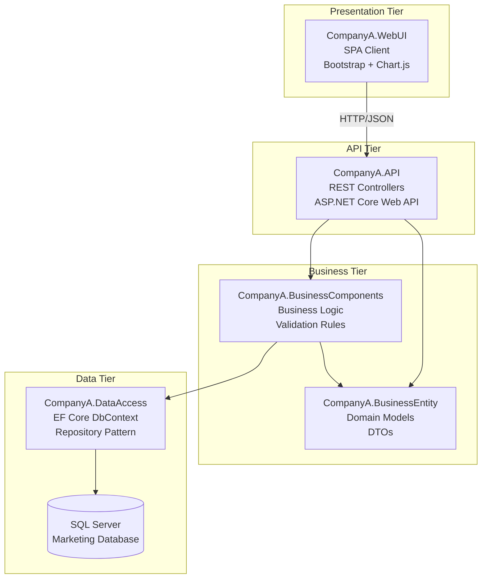

# System Architecture

## Overview

The Marketing Personnel Management System follows a layered architecture pattern with REST microservices, implementing separation of concerns and maintainability principles.

## Architectural Patterns

### Layered Architecture
- **Presentation Layer**: Single Page Application (SPA)
- **API Layer**: REST microservices
- **Business Logic Layer**: Domain services and validation
- **Data Access Layer**: Entity Framework Core
- **Database Layer**: SQL Server

### Microservices Architecture
Each domain entity has dedicated REST endpoints:
- **Personnel Service**: CRUD operations for marketing personnel
- **Sales Service**: Sales record management (add/delete only)
- **Commission Profile Service**: Commission structure management
- **Reports Service**: Management and finance reporting

## Component Diagram



## Technology Stack

### Frontend
- **Framework**: Vanilla JavaScript SPA
- **UI Library**: Bootstrap 5
- **Charts**: Chart.js
- **HTTP Client**: Fetch API
- **Build**: No build process required

### Backend
- **Runtime**: .NET 6+ / .NET Core
- **Web Framework**: ASP.NET Core Web API
- **ORM**: Entity Framework Core
- **Database**: SQL Server 2016+
- **Serialization**: System.Text.Json

### Infrastructure
- **Web Server**: IIS
- **Database Server**: SQL Server
- **Deployment**: xcopy deployment model

## Data Flow

### Personnel Management Flow
```
User Action → SPA → REST API → Business Logic → EF Core → Database
                ↓
            Validation → Response → JSON → UI Update
```

### Sales Visualization Flow
```
Personnel Selection → GET /api/sales?personnelId=X → 
Business Logic → Database Query → JSON Response → 
Chart.js Rendering (Grid/Graph Toggle)
```

### Reporting Flow
```
Report Request → GET /api/reports/{type} → 
Business Calculations → Aggregated Data → 
CSV Export / JSON Display
```

## Security Architecture

### Data Protection
- Server-side validation on all inputs
- SQL injection prevention via EF Core parameterized queries
- XSS protection via proper encoding

### Configuration Security
- Connection strings in configuration files
- No hardcoded credentials
- Environment-specific settings

### API Security
- CORS configuration for cross-origin requests
- Input sanitization at controller level
- Proper HTTP status codes and error handling

## Scalability Considerations

### Database Design
- Proper indexing on foreign keys
- Cascade delete relationships
- Normalized schema design

### API Design
- RESTful endpoints with proper HTTP verbs
- Stateless service design
- JSON-based communication

### Frontend Performance
- Minimal JavaScript dependencies
- Efficient DOM manipulation
- Responsive design patterns

## Deployment Architecture

### Development Environment
```
Developer Machine
├── Visual Studio/VS Code
├── SQL Server LocalDB/Express
├── IIS Express
└── Browser Testing
```

### Production Environment
```
IIS Server
├── CompanyA.WebUI (Static Files + Razor Host)
├── CompanyA.API (Web API Application)
└── SQL Server Database
```

## Error Handling Strategy

### API Layer
- Global exception handling middleware
- Structured error responses
- Logging integration

### Frontend Layer
- User-friendly error messages
- Validation feedback
- Network error handling

### Database Layer
- Transaction management
- Constraint violation handling
- Connection resilience

## Monitoring and Logging

### Application Logging
- Structured logging with categories
- Error tracking and debugging
- Performance monitoring

### Database Monitoring
- Query performance tracking
- Connection pool monitoring
- Deadlock detection

## Future Considerations

### Scalability Enhancements
- API versioning strategy
- Caching implementation
- Database partitioning

### Security Enhancements
- Authentication/authorization system
- API rate limiting
- Audit logging

### Feature Extensions
- Real-time notifications
- Advanced reporting
- Mobile responsiveness
